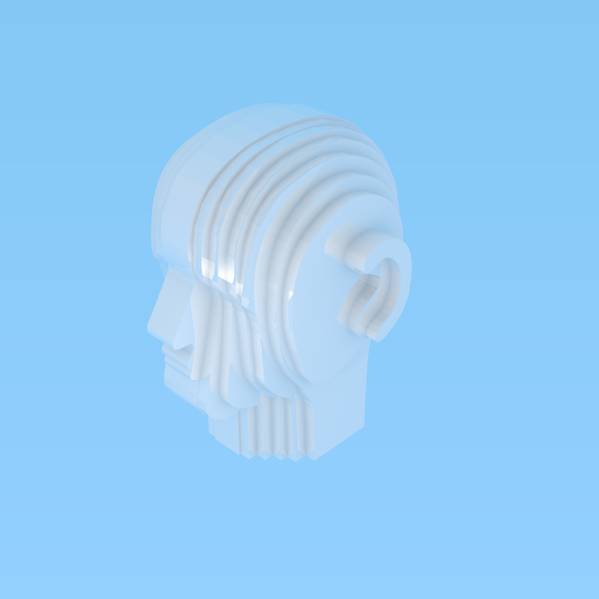

# Album Cover Head Thing

This is an exercise in learning Blender 3D modeling, and exporting it TODO.

The files can be used to create a real life version of the DEEWEE Head,
the icon and album cover of Soulwax's amazing album `From DEEWEE`,
which itself is a chrome version of the AKG D-99 C `Harry`.
These binaural microphones are incredibly expensive specialist pieces of audio hardware,
and I just want a fancy looking mantelpiece.

# Legal and being a fan

The brands DEEWEE and Soulwax and the images used to derive this work do not belong to me.
This repository does not host any copyrighted material, it only contains my work.

I want to give Soulwax all credit for they deserve for creating such a strong musical and visual brand.
Consider buying their music, or seeing them live, they really put on a great show.
They also sell their own small version of the head
[right here](https://store.soulwax.com/products/deewee-chrome-head-keyring) on their store.

# Deriving the Head

This documents the steps I took to produce the files found in this repository.

## Creating the model

Using the intro shots of this video as a reference:

I outlined the model in blender using [this](https://en.wikibooks.org/wiki/Blender_3D:_Noob_to_Pro/Modeling_a_Wolf_from_Guide_Images) method.

## TODO

Export into a make-able format.
