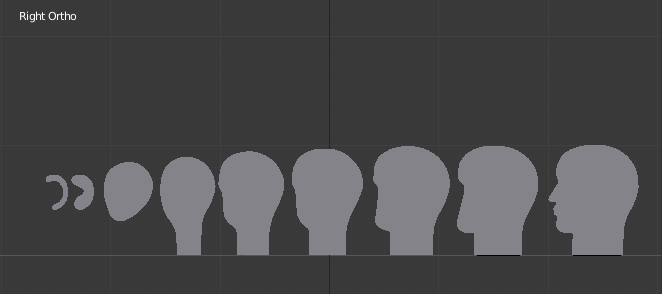
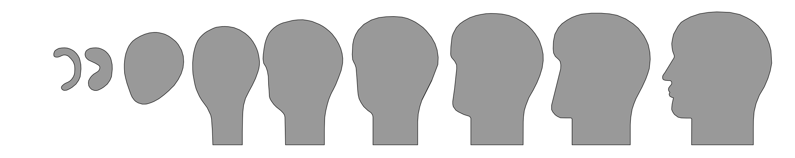

# Album Cover Head Thing

This is an exercise in learning Blender 3D modeling.

This is my attempt at modeling the DEEWEE Head,
the icon and album cover of Soulwax's amazing album `From DEEWEE`,
which itself is a chrome version of the AKG D-99 C `Harry`.

# Legal and being a fan

The brands DEEWEE and Soulwax and the images used to derive this work do not belong to me.
This repository does not host any copyrighted material,
it only contains my work that I chose release under the Creative Commons Attribution 4.0 license.

I want to give Soulwax all credit for they deserve for creating such a strong musical and visual brand.
Consider buying their music, or seeing them live, they really put on a great show.
They also sell their own small version of the head
[right here](https://store.soulwax.com/products/deewee-chrome-head-keyring) on their store.

# Deriving the Head

This documents the steps I took to produce the files found in this repository.

## Creating the model

Using the intro shots of this video as a reference:

I outlined the model in blender using [this](https://en.wikibooks.org/wiki/Blender_3D:_Noob_to_Pro/Modeling_a_Wolf_from_Guide_Images) method.

## Creating the 2D Faces

Still using blender, I removed all edges parallel to the X-axis,
leaving only the large faces that cross-sect the head from front to back.
Next I took each of this face and moved them to be on `X=0`,
creating the blend file `head_flattened`, as shown in the following image.

## SVG

By using the blender addon "Freestyle SVG Exporter", the following SVG file was created:

This is done by setting an orthographic camera to look straight at the right side, and rendering with the addon enabled.
